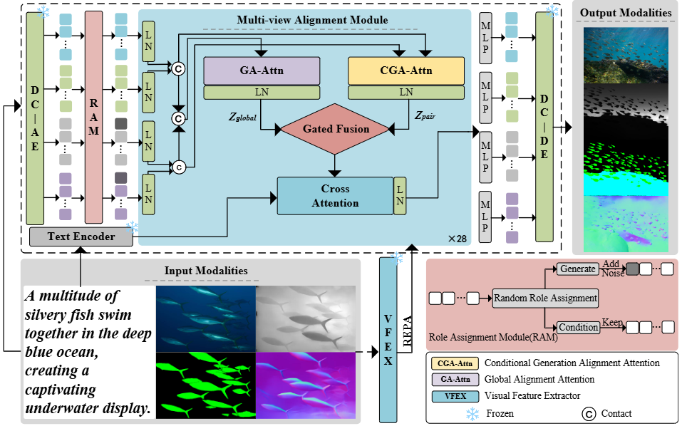
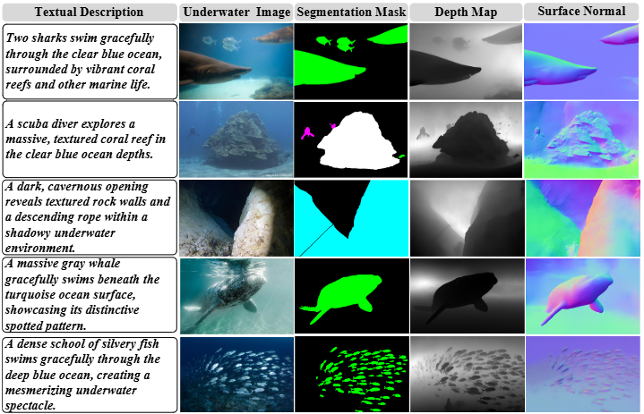

This repository provides code and datasets related to the paper: 

### **UMDM-USG: A Unified Multi-view Diffusion Model for Underwater Scene Generation via Cross-View Representation Alignment**.


### Architecture

------




### Dataset Download

------



Underwater Text–Mask–Depth–Normal Dataset


### Installation

------

Create and activate a new conda environment:

```
conda create -n UMDM python=3.9.0 -y
conda activate UMDM
pip install -r requirements.txt
```


### Training

------

To train the UMDM-USG model, run:

```
sh scripts/train_loss.sh ./configs/train_underwater.yaml
```


### Citation

------

If you find our work useful in your research, please consider citing:
```
@ARTICLE{
    author={Yifan Zhu, Chengjia Wang, Xinghui Dong},
    journal={Pattern Recognition}, 
    title={UMDM-USG: A Unified Multi-view Diffusion Model for Underwater Scene Generation via Cross-View Representation Alignment}, 
    year={2026},
    }
```

